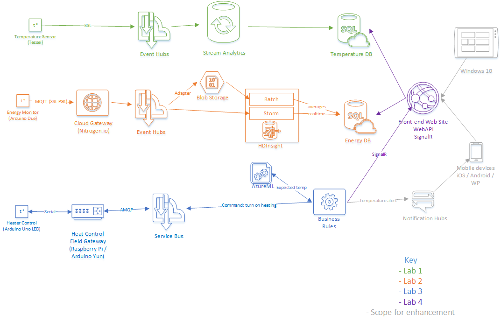

Microsoft Developer eXperience: IoT hands-on labs
=================================================

Set of isolated labs for AzureML, Stream Analytics, HDInsight, Storm, based on Tessel, Arduino and Raspberry Pi devices.

- [Lab1](lab1-temperature sensor/) deals with collecting and processing temperature readings 
- [Lab2](lab2-energy monitor/) deals with collecting and processing energy readings at massive scale
- [Lab3](lab3-device control/) deals with responding to state and commanding remote devices
- [Lab4](lab4-visualisations/) deals with an overall visualisation of the system

