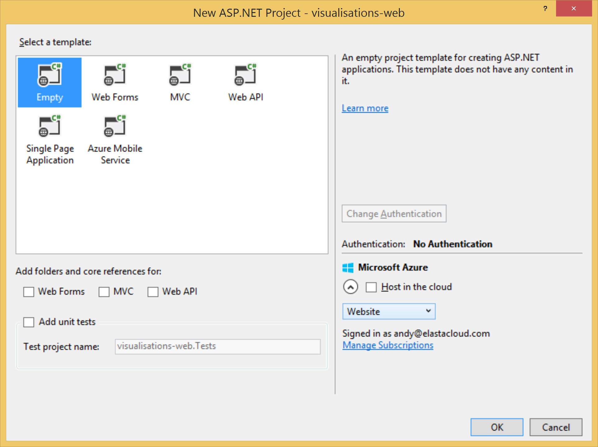
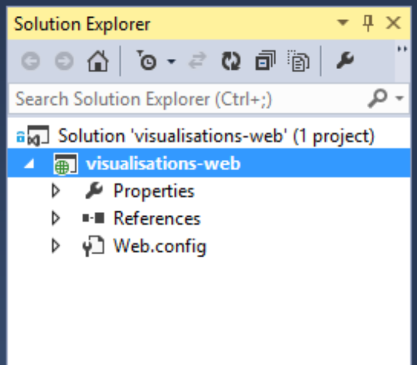

# IoT Smart home Hackathon Lab #

## Lab 4 Visualisation ##

A key challenge for the IoT is to provide homeowners with visualisations of the state of their Smart Homes. The disparate nature of components and varying pathways through the system mean that gaining a view on the system is difficult. Therefore this lab will focus on giving customers a single view on the state of the system, including real time updates on the state of the Devices under system control and regularly aggregated results from temperatures sensors and energy monitors. 

This single view is implemented as a HTML5 website, using javascript in the browser to update data points presented in both textual, pictographic and charted form.

## Building a Real Time Website ##

This lab will use the ASP.NET web development stack and in order to achieve a user experience that delivers data driven content with low latency, matching the real time nature of the data, we will be using ASP.NET SignalR for real time message delivery.

#### Discussion Point

>Instead of ASP.NET SignalR, which other technologies would suit? How would we do this with node.js? 


### Choosing real time data points ###

It is an important exercise to undertake to choose data points that are suited to real time messaging between web client and server. The more aspects of real time interaction that we introduce to the visualisation website, the higher the overall load we place on the remote web server. Furthermore, the we must choose data points intelligently; if we make the web server work to continually refresh data points that are static, we waste capacity across our system. 

Let's explore the data points available to us:

1. From **Lab1**: The current and historic energy usage of a Smart Home. The historic energy usage is not likely to change frequently. It is likely this will change only overnight, as batch processes often run in this timeframe.  The current energy usage however is likely to change frequently. It is therefore a candidate for real time data transfer. We can design a system to push this data to the homeowner in real time.
2. From **Lab2**: The recent temperature, averaged over the past 1 minute is provided in a data store by Stream Analytics. The data change frequency is no more than this 1 minute interval, so we don't need to push this in real time. Instead, the web client can poll every minute to retrieve this data.
3. From **Lab3**: The current state of the heater. This is tied to the change in state detected by AzureML based on the data frequency of Lab2. Since this is again a minimum refresh time of 1 minute, the web client can poll again. 

### Design a UI ###

What we really want is a single view grid of the state of our system. If we split our page up into the four main areas of data logged by our system we have:

- Current Temperature - ie. 10&deg;C
- Temperature History - ie. a chart
- Energy Usage - i.e. a chart
- Current Heater Status - i.e. a pictograph depicting on/off

We can build a simple, single view of data using HTML5 using [Bootstrap](https://github.com/twbs/bootstrap) in order to ease our UI concerns. Bootstrap lends itself to quickly building this type of UI.


### Scaffold a UI Project ###

Starting with a vanilla ASP.NET project in Visual Studio (screenshots in this lab are Ultimate 2013), select an Empty Project.




This gives us a new empty project. 



We will start by adding the dependencies we need; using Nuget to add Bootstrap and SignalR:


Once these are installed, we have a project structure that contains all the basic elements that we need.


Now we need to create a few files that are specific to our application

- ~/App_Start/Startup.cs - an OWIN startup file the enables SignalR, without this our SignalR Middleware won't be loaded and won't be available.
- ~/Content/css/iotlabs.css - a file for our custom stylesheets
- ~/Scripts/iotlabs.js - a file for our application javascript
- [~/index.html](visualisations-web/visualisations-web/index.html) - a html page to host our app!

####Startup.cs####
```csharp
[assembly: OwinStartup(typeof(visualisations_web.App_Start.Startup))]

namespace visualisations_web.App_Start
{
    public class Startup
    {
        public void Configuration(IAppBuilder app)
        {
            app.MapSignalR();
        }
    }
}
```

This is our basic UI Scaffold, which we can now go on to extend with custom application logic that will provide the runtime elements of our Visualisation. Currently our project does nothing, it has no SignalR or data access elements, so lets start there.

### Data Driving our Visualisation website ###

Our data sources for our visualisation are:

- EnergyDb, a data source in SQL Server that includes average, historic energy readings generated by Lab1 using Hadoop Map Reduce
- EnergyRedis, a data source in Redis that includes realtime data readings generated by Lab1 using Hadoop Storm
- TemperatureDb, a data source in SQL Server that includes per minute averaged temperature readings generated by Lab2 using Stream Analytics

SQL Server is used for relational data storage. The primary use case for Redis allows for transient data to exist in the database and then expire after it loses relevance. In turn, this means we can guarantee only a small number of records exist in the database, allowing fast access and low management overhead despite the fact that hundreds of thousands of records may be committed to the database every hour. 

The two SQL Server data sources will be accessed using Microsoft's Entity Framework.

The Redis data source will be accessed using StackExchange.Redis.

Both of these libraries are loaded into the project using Nuget.

#### Polling for Data

The nature of both EnergyRedis and TemperatureDb is that data will be constantly changing. Every minute, the current temperature will be added as the newest record in the average temperature table. Every second, many records may be added to the EnergyRedis store. 

In order to make the website visualisation constantly show timely data, the website will open connections to SignalR hubs which will constantly poll for data and send updates when available. This means the webserver will run processes for each user that are accessing and distributing data.

#### Notification of State

Lab 3 introduces an additional piece of state that is held by the system and never persisted to the database; the current state of the Heater. This is never stored since we can always send a messages to the heater and query its status directly. This approach of directly accessing information rather than storing it in the database introduces some latency into the system, but puts the accuracy of this data at the fore. 

The state of the heater may change by the operation of the system, but since it is never persisted to a data store, there is no way for the web visualisation to gain access to it. Instead the web visualisation exposes a HTTP endpoint that can receive a message from the Lab 3 code which communicates the current status every time it is measured. 

The SignalR hub will react to the HTTP message from the Lab 3 code and modify the display to show the status of the Heater.

### Implementing our Data Driven Page

The approach taken by this visualisation is as a Single Page Application (SPA); replacing the need for the user to interact with the page and use mouse events to navigate to between items of note with a persistent, always on dashboard that updates itself. There are many SPA oriented frameworks available that allow for complex SPAs to be build, but in this case we will keep things simple and just use Javascript, [JQuery](http://jquery.com), [Highcharts](http://www.highcharts.com/) and HTML. 

We can break up our dashboard into areas of function. These are:

1. Current Temperature
2. Average Temperature Chart
3. Recent Energy Usage Chart
4. Heater Status

In order to build this, we will add an index.html page, and use a bootstrap grid layout to build the UI areas in a 2x2 grid;


#### Approach to UI

There are two main approaches to updating the UI. Both are powered by Javascript and JQuery. 

The first approach is to use HighCharts to plot a chart; used by Temperature history and Energy Usage charts.

The second approach is DOM manipulation, using JQuery to modify the loaded document's content. This is used to modify the innerText of the Current Temperature and heater status, and to modify visibility of some elements of a SVG used to display the heater pictograph.

## Code for Visualisation

The code for visualisation is in the ~/Scripts/iotlabs.js

### SignalR data transfer

ASP.NET SignalR is used to send messages from the server to the client and update the html page without the user having to interact with it. The approach for this is for the client to create a function that the SignalR hub can call, connect to SignalR with the SignalR Client and then use c# in ASP.NET SignalR to issue events. These events call back into the function that we earlier created and the javascript can take over responsibility of drawing data contained by the event onto the screen.

*Creating a Javascript client function for SignalR to invoke*

```javascript
var energyMonitoringProxy = $.connection.energyMonitorHub;
    energyMonitoringProxy.client.pump = function (readings) {
        console.log(readings);
        drawEnergyChart(readings);
    };
```


*Using SignalR to invoke the function*

```csharp
private async Task Run(string deviceId)
        {
            var energyRedis = ConfigurationManager.ConnectionStrings["EnergyRedis"].ConnectionString;
            var energyCtx = new CurrentEnergyContext(energyRedis);
            
            while (true)
            {
                var readings = energyCtx.GetReadings(deviceId);
                _hubContext.Clients.Group(deviceId).pump(readings);

                await Task.Delay(1000);
            }
        }
```

#### Discussion Point

> In the above SignalR, the server invokes clients that belong to a "Group" of the DeviceId. How would you modify the UI and server to allow multiple energy monitors to be enabled? For instance, how would you extend this to support a smart house with multiple rooms having energy monitored separately?
