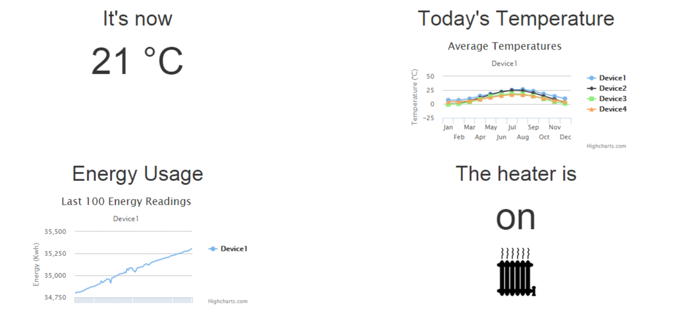

# IoT Smart home Hackathon Lab #

## Lab 4 Visualisation ##

A key challenge for the IoT is to provide homeowners with visualisations of the state of their Smart Homes. The disparate nature of components and varying pathways through the system mean that gaining a view on the system is difficult. Therefore this lab will focus on giving customers a single view on the state of the system, including real time updates on the state of the Devices under system control and regularly aggregated results from temperatures sensors and energy monitors. 

This single view is implemented as a HTML5 website, using javascript in the browser to update data points presented in both textual, pictographic and charted form.

## Building a Real Time Website ##

This lab will use the ASP.NET web development stack and in order to achieve a user experience that delivers data driven content with low latency, matching the real time nature of the data, we will be using ASP.NET SignalR for real time message delivery.

### Choosing real time data points ###

It is an important exercise to undertake to choose data points that are suited to real time messaging between web client and server. The more aspects of real time interaction that we introduce to the visualisation website, the higher the overall load we place on the remote web server. Furthermore, the we must choose data points intelligently; if we make the web server work to continually refresh data points that are static, we waste capacity across our system. 

Let's explore the data points available to us:

1. From Lab1: The current and historic energy usage of a Smart Home. The historic energy usage is not likely to change frequently. It is likely this will change only overnight, as batch processes often run in this timeframe.  The current energy usage however is likely to change frequently. It is therefore a candidate for real time data transfer. We can design a system to push this data to the homeowner in real time.
2. From Lab2: The recent temperature, averaged over the past 1 minute is provided in a data store by Stream Analytics. The data change frequency is no more than this 1 minute interval, so we don't need to push this in real time. Instead, the web client can poll every minute to retrieve this data.
3. From Lab3: The current state of the heater. This is tied to the change in state detected by AzureML based on the data frequency of Lab2. Since this is again a minimum refresh time of 1 minute, the web client can poll again. 

### Design a UI ###

What we really want is a single view grid of the state of our system. If we split our page up into the four main areas of data logged by our system we have:

- Current Temperature - ie. 10&deg;C
- Temperature History - ie. a chart
- Energy Usage - i.e. a chart
- Current Heater Status - i.e. a pictograph depicting on/off

We can build a simple, single view of data using HTML5 using [Bootstrap](https://github.com/twbs/bootstrap) in order to ease our UI concerns. Bootstrap lends itself to quickly building this type of UI.

